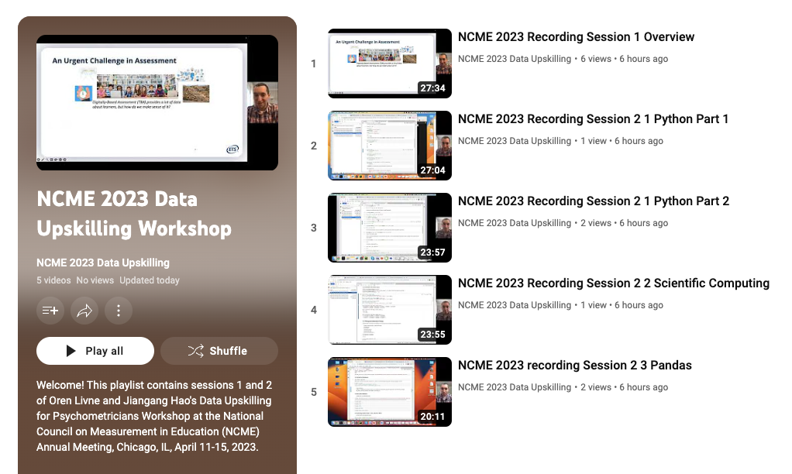

# NCME2023 data science upskilling workshop
#### 8:00 AM - 12:00 AM, 1:00 PM - 5:00 PM, April 12 2023
#### Chicago Ballroom B
#### Instructor: Jiangang Hao (onsite) and Oren Livne (pre-recorded videos)

This repository contains the course materials of the training workshop. To start binder session, click the following icon. 

[](https://mybinder.org/v2/gh/jgbrainstorm/NCME2023-data-science-workshop/HEAD)


### Introduction

Digitally Based Assessments (DBAs) provide valuable insights into the response process of test takers. However, the substantial increase in volume, velocity, and variety of data presents new challenges for psychometricians to effectively handle, analyze, and interpret the data to extract meaningful insights. To address these challenges, the emerging interdisciplinary field of data science offers a range of techniques and practices that should be adopted into the toolkit of next-generation psychometrics. This workshop aims to equip psychometricians and data analysts with essential data science skills and modeling strategies specifically in the context of DBAs. Participants will learn how to effectively work with big and complex data using Python, which is currently the dominant programming language in data science. The workshop will incorporate the latest developments in Python machine learning packages to provide participants with the most relevant and up-to-date knowledge in the field.

### Prerequisites

Basic knowledge in statistics and python programming language. 


### Learning Goals
* Learn the basics of data science
* Learn how to perform data wrangling in Python
* Learn how to do data visualization and build dashboard
* Learn the basics of machine learning and some typical algorithms
* Learn how to use machine learning in Python and Orange


### Setup virtual environment
You can use conda or mamba <https://github.com/conda-forge/miniforge>. Download and install. After that, clone the current github repository and then enter into that directory/folder. Do the following

1. Create a python 3.10 virtual environment by
```
mamba create -n ncme23 python=3.10
```

2. Activate the environment by:
```
mamba activate ncme23
```

3. Install the packages in the requirements.txt file
```
mamba install --file requirements.txt
```


### References

Von Davier, A., Mislevy, R., & Hao, J. (Eds.), Computational Psychometrics: New Methodologies for a New Generation of Digital Learning and Assessment, Springer. <https://link.springer.com/book/10.1007/978-3-030-74394-9>


### Schedule (may subject to adjustments)
8:00 AM - 12:00 PM; 1:00 PM - 5:00 PM

* Session 1: General Introduction
* Session 2: Python ABC
* Session 3: Data science, wrangling, visualization and dashboarding
* Session 4: Machine learning, parallel computing

### Prerecorded tutorials (for Session 1 and 2, click the picture below to see the playlist)
[](https://www.youtube.com/playlist?list=PLTjGXYWEXkmcQw6kz16TkjdNK8V1Qk1SL)


### Leave us your feedback by clicking the following URL after the workshop
<https://forms.gle/L3hTTubLUcagbdWy8>